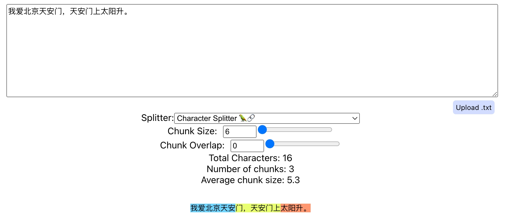
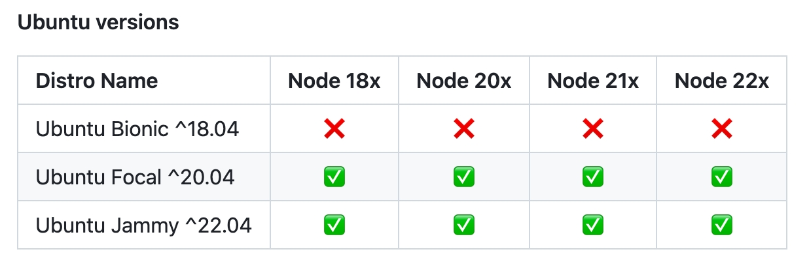
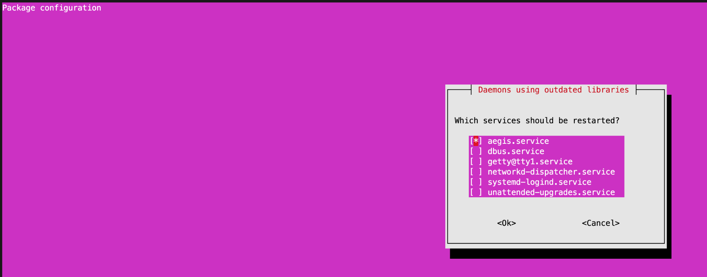
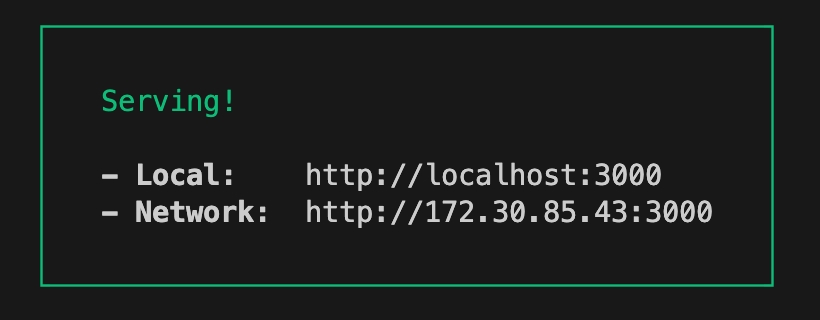

# Chunk Viz

基于Greg Kamradt的Chunk Viz项目，探索LangChain文本切分的可视化效果。<br>

注意: 使用前请保证你的操作系统支持 Nodejs 18.x 以上版本。(血淋淋的教训🩸)<br>

笔者为了这个项目还专门把自己的系统从 ubuntu 18 改成了 ubuntu 20。ubuntu 18 最高只支持 Nodejs 16.x。<br>



- [Chunk Viz](#chunk-viz)
  - [前提:](#前提)
  - [Nodejs安装流程:](#nodejs安装流程)
    - [可能遇到的问题:](#可能遇到的问题)
  - [当前项目安装流程:](#当前项目安装流程)
    - [Step 1: 克隆本仓库](#step-1-克隆本仓库)
    - [Step 2: 安装依赖项](#step-2-安装依赖项)
    - [Step 3: 构建项目](#step-3-构建项目)
    - [Step 4: 本地运行](#step-4-本地运行)
  - [补充说明: chunk overlap的作用](#补充说明-chunk-overlap的作用)
    - [为什么增大chunk overlap会增加最终切块的数量:](#为什么增大chunk-overlap会增加最终切块的数量)
    - [结论](#结论)

## 前提:

运行本项目前，首先要保证自己系统有Nodejs 18.x以上版本。可以通过以下指令查看自己系统是否拥有Nodejs:<br>

```bash
node -v
npm -v
```

如果没有Nodejs，可以在Nodejs的github查看自己系统的支持版本，然后遵循之后的步骤安装Nodejs。<br>

Nodejs的github链接如下:<br>

```log
https://github.com/nodesource/distributions
```

系统版本与Nodejs匹配图如下:<br>



nodejs版本的维护时间可以通过下列网址查看:<br>

```log
https://github.com/nodejs/release?tab=readme-ov-file#release-schedule
```

## Nodejs安装流程:

确定自己操作系统适合的Nodejs版本后，参考以下指令，依次运行下列指令安装Nodejs:<br>

```bash
# 下载并运行NodeSource的安装脚本
curl -fsSL https://deb.nodesource.com/setup_20.x | sudo -E bash -
# 安装nodejs
apt-get install nodejs -y
```

安装完成后可查看nodejs版本:<br>

```bash
node -v
npm -v
```

效果如下:<br>

```log
(base) root@iZ2zea5v77oawjy2qz7c20Z:/data/ChunkViz# node -v
v20.12.2
(base) root@iZ2zea5v77oawjy2qz7c20Z:/data/ChunkViz# npm -v
10.5.0
```

使用NodeSource的安装脚本来安装Node.js时，脚本会自动处理环境变量的设置。这意味着Node.js和npm的可执行文件的路径会被自动添加到你的系统的PATH环境变量中。这样你就可以在任何地方通过终端运行node和npm命令。<br>

### 可能遇到的问题:



这个界面出现在Ubuntu系统中，通常在更新某些软件包后，系统会检测到有一些守护进程使用了过时的库。为了让这些更新生效，系统建议你重新启动这些服务。<br>

如果服务前面有`[*]`，表示它将被重启；如果是`[ ]`，则表示不会重启。如果你不确定哪些服务需要重启，通常安全的做法是重启所有列出的服务，因为这会确保所有服务都使用最新的软件库运行。<br>

重启服务不会影响当前正在运行的应用程序或用户会话，只是相关的后台服务会重新启动以使用新的库文件。<br>

在这种情况下，你可以：<br>

1. 使用方向键上下移动，以选择每个服务。
2. 使用空格键选择或取消选择服务。
3. 一旦选择了所有你希望重启的服务，按Tab键移动到`<Ok>`按钮。可以不改变`*`号，直接移动到`<Ok>`按钮确认。
4. 按下回车键确认你的选择。

选择`<Ok>`并确认后，系统会重启选定的服务。如果你选择`<Cancel>`，则不会重启任何服务，但是可能需要在稍后手动重启这些服务，以确保它们使用更新后的库文件。如果你不确定，建议选择重启所有服务。<br>


## 当前项目安装流程:

### Step 1: 克隆本仓库

```bash
git clone git@github.com:peilongchencc/ChunkViz.git
```

### Step 2: 安装依赖项

```bash
# 切换到项目目录
cd ChunkViz
```

```bash
# 安装依赖项
npm install
```

安装后的log信息:<br>

```log
(base) root@iZ2zea5v77oawjy2qz7c20Z:/data/ChunkViz# npm install

added 310 packages, removed 313 packages, changed 337 packages, and audited 1817 packages in 52s

275 packages are looking for funding
  run `npm fund` for details

13 vulnerabilities (6 moderate, 7 high)

To address issues that do not require attention, run:
  npm audit fix

To address all issues (including breaking changes), run:
  npm audit fix --force

Run `npm audit` for details.
npm notice 
npm notice New minor version of npm available! 10.5.0 -> 10.6.0
npm notice Changelog: https://github.com/npm/cli/releases/tag/v10.6.0
npm notice Run npm install -g npm@10.6.0 to update!
npm notice 
(base) root@iZ2zea5v77oawjy2qz7c20Z:/data/ChunkViz# 
```

### Step 3: 构建项目

```bash
# 构建项目
npm run build
```

笔者修改了 `src/App.js` 文件，使最终的网页效果为双语版。原版文件名称笔者改为了 `src/App_backup.js`，如果想要看原版，可以使用这个文件。记得要重新 `build` 才能看到修改后的效果。<br>

构建信息如下:<br>

```log
(base) root@iZ2zea5v77oawjy2qz7c20Z:/data/ChunkViz# npm run build

> chunkviz@0.1.0 build
> react-scripts build

Creating an optimized production build...
One of your dependencies, babel-preset-react-app, is importing the
"@babel/plugin-proposal-private-property-in-object" package without
declaring it in its dependencies. This is currently working because
"@babel/plugin-proposal-private-property-in-object" is already in your
node_modules folder for unrelated reasons, but it may break at any time.

babel-preset-react-app is part of the create-react-app project, which
is not maintianed anymore. It is thus unlikely that this bug will
ever be fixed. Add "@babel/plugin-proposal-private-property-in-object" to
your devDependencies to work around this error. This will make this message
go away.
  
Compiled successfully.

File sizes after gzip:

  80.95 kB  build/static/js/main.f2a1034c.js
  1.77 kB   build/static/js/787.daa8f7ff.chunk.js
  721 B     build/static/css/main.4fdf49ed.css

The project was built assuming it is hosted at /.
You can control this with the homepage field in your package.json.

The build folder is ready to be deployed.
You may serve it with a static server:

  npm install -g serve
  serve -s build

Find out more about deployment here:

  https://cra.link/deployment

(base) root@iZ2zea5v77oawjy2qz7c20Z:/data/ChunkViz#
```

### Step 4: 本地运行

```bash
npm start
```



现在，你就可以点击网址访问程序了。<br>


## 补充说明: chunk overlap的作用

langchain的`CharacterTextSplitter`是一个用来将文本分割成更小块（chunks）的工具。这种分割通常在处理长文本数据时使用，以便模型可以更有效地匹配到相似数据。其中，`chunk overlap`（块重叠）是一个关键参数，它决定了每个文本块之间的重叠字符数量。<br>

`chunk overlap`的主要作用是确保在分割文本时，关键信息或句子结构不会被截断。增大`chunk overlap`的值可以减少信息丢失的风险，因为相邻的文本块会共享更多的内容。这尤其对于需要保持语境连贯性的任务（如全文翻译或文本摘要）来说非常重要。<br>

### 为什么增大chunk overlap会增加最终切块的数量:

假设我们有一段文本：“我爱北京天安门，天安门上太阳升。”<br>

- **不使用重叠**（chunk overlap = 0）: 如果我们设置每个块的长度为6个字符，分割结果是：
  - “我爱北京天安”
  - “门，天安门上”
  - “太阳升”

这种情况下，文本被平均分割成三个部分，但每个块之间完全独立，可能导致语境被切断。<br>

- **使用重叠**（chunk overlap = 1）：如果同样设置每个块的长度为6个字符，但每个块与下一个块重叠1个字符，分割结果是：
  - “我爱北京天安”
  - “安门，天安门”
  - “门上太阳升”

在这种情况下，由于每个块都与前一个块共享1个字符，所以需要更多的块来覆盖整个文本，从而增加了块的总数。这种方法有助于保持文本的连贯性，特别是在边界处。做文本匹配的时候也更容易匹配到相关内容(毕竟信息更丰富了)。<br>

### 结论

因此，增大`chunk overlap`可以帮助保持文本块之间的语义连贯性，但同时也会增加生成的文本块数量，这可能导致处理速度变慢或需要更多的计算资源。选择合适的`chunk overlap`值是一个需要考虑到效率和效果平衡的决策。<br>